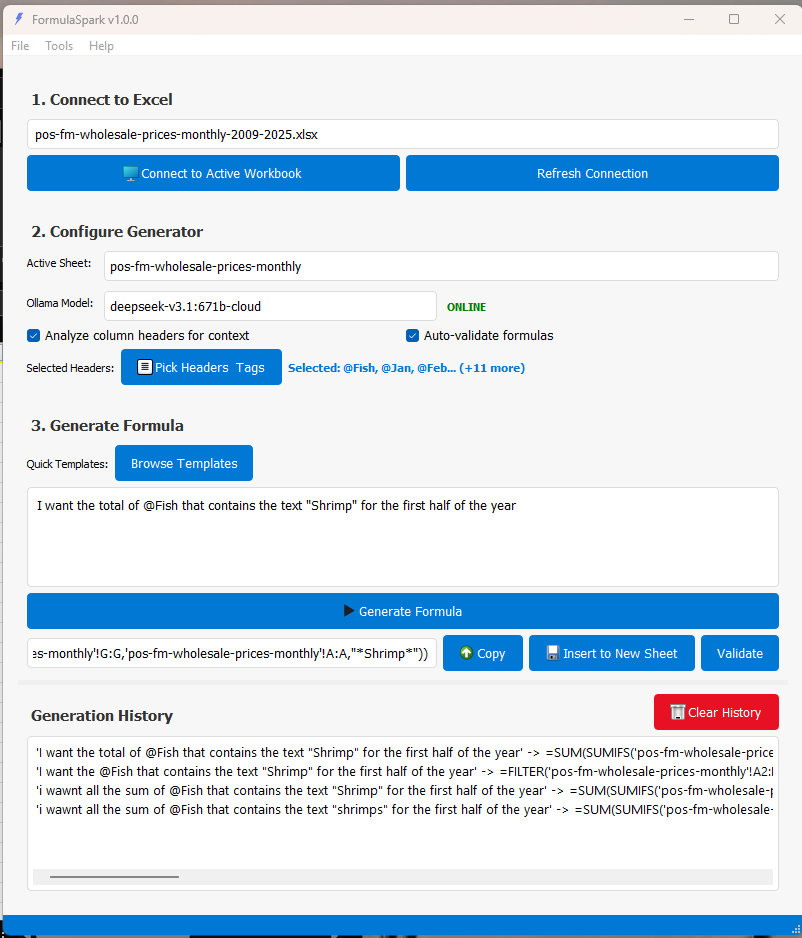
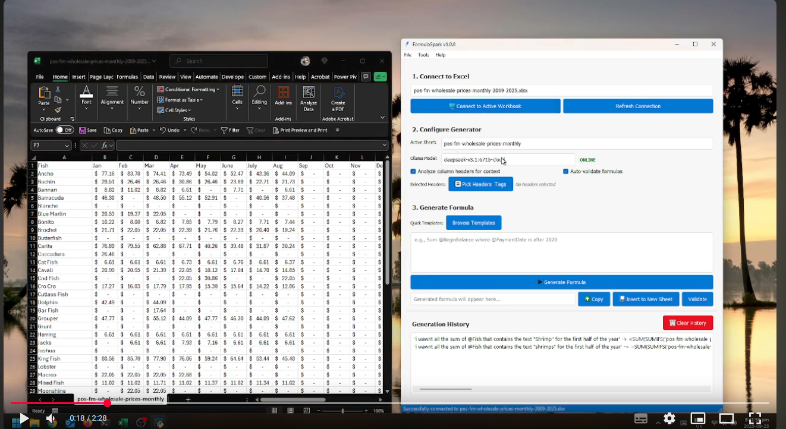

# FormulaSpark

<div align="center">


**An Intelligent Excel Formula Generator Powered by Ollama AI**

[](https://python.org)
[](https://pypi.org/project/PyQt5/)
[](https://ollama.com)
[]()

</div>

FormulaSpark is a professional-grade desktop application that transforms natural language descriptions into precise Excel formulas using local AI models via Ollama. Built with PyQt5, it provides an intuitive interface for Excel users to generate complex formulas without memorizing syntax.

## 📑 Table of Contents

- [📸 Screenshots](#-screenshots)
- [🎯 What is FormulaSpark?](#-what-is-formulaspark)
- [🏗️ Architecture Overview](#️-architecture-overview)
- [🔄 How FormulaSpark Works](#-how-formulaspark-works)
- [📁 Project Structure](#-project-structure)
- [🚀 Features](#-features)
- [📦 Installation](#-installation)
- [🎬 Demo](#-demo)
- [🎯 Usage Guide](#-usage-guide)
- [⚙️ Configuration](#️-configuration)
- [🔧 Development](#-development)
- [📊 Performance](#-performance)
- [🐛 Troubleshooting](#-troubleshooting)
- [🤝 Contributing](#-contributing)
- [📄 License](#-license)
- [🎉 Acknowledgments](#-acknowledgments)
- [🔮 Future Roadmap](#-future-roadmap)

## 📸 Screenshots

<div align="center" style="width:400px">

### Main Interface
 
*The main FormulaSpark interface showing the formula generation panel*


</div>

## 🎯 What is FormulaSpark?

FormulaSpark bridges the gap between human language and Excel formulas. Instead of struggling with complex Excel syntax, users simply describe what they want in plain English, and FormulaSpark generates the appropriate formula using AI.

### Key Capabilities
- **Natural Language Processing**: Convert English descriptions to Excel formulas
- **Context-Aware Generation**: Analyzes Excel headers for better accuracy
- **Smart Tag System**: Use meaningful tags instead of column letters
- **Formula Validation**: Ensures generated formulas work correctly
- **Intelligent Caching**: Speeds up repeated requests
- **Local AI Processing**: Complete privacy with Ollama integration

## 🏗️ Architecture Overview

FormulaSpark follows a clean, modular architecture that separates concerns for maintainability and extensibility:

```
┌─────────────────────────────────────────────────────────────────┐
│                    USER INTERFACE LAYER                        │
├─────────────────────────────────────────────────────────────────┤
│  Main Window  │  Dialog Components  │  Autocomplete System     │
│     (UI)      │     (DIALOGS)       │      (AUTOC)             │
└─────────────────────────────────────────────────────────────────┘
                              │
                              ▼
┌─────────────────────────────────────────────────────────────────┐
│                    CORE BUSINESS LOGIC                         │
├─────────────────────────────────────────────────────────────────┤
│  Config Manager  │  Excel Handler  │  Formula Validator        │
│    (CONFIG)      │    (EXCEL)      │     (VALID)               │
└─────────────────────────────────────────────────────────────────┘
                              │
                              ▼
┌─────────────────────────────────────────────────────────────────┐
│                   AI INTEGRATION LAYER                         │
├─────────────────────────────────────────────────────────────────┤
│  Ollama Client  │  Formula Cache  │  Async Worker Threads      │
│   (OLLAMA)      │    (CACHE)      │      (WORKER)              │
└─────────────────────────────────────────────────────────────────┘
                              │
                              ▼
┌─────────────────────────────────────────────────────────────────┐
│                    EXTERNAL SYSTEMS                            │
├─────────────────────────────────────────────────────────────────┤
│  Microsoft Excel  │  Ollama Server  │  AI Model                │
│   (EXCEL_APP)     │ (OLLAMA_SERVER) │  (AI_MODEL)              │
└─────────────────────────────────────────────────────────────────┘

DATA FLOW:
UI ──→ CONFIG ──→ Settings & Preferences
UI ──→ EXCEL ──→ EXCEL_APP (Excel Integration)
UI ──→ OLLAMA ──→ OLLAMA_SERVER ──→ AI_MODEL
OLLAMA ──→ CACHE (Formula Caching)
OLLAMA ──→ WORKER (Async Processing)
VALID ──→ EXCEL (Formula Testing)
```

## 🔄 How FormulaSpark Works

The application follows a sophisticated workflow that ensures accurate formula generation:

```
STEP 1: EXCEL CONNECTION
┌─────────────┐    ┌─────────────┐    ┌─────────────┐
│    User     │───▶│FormulaSpark │───▶│Excel Handler│
│             │    │     UI      │    │             │
└─────────────┘    └─────────────┘    └─────────────┘
                           │                   │
                           │                   ▼
                           │            ┌─────────────┐
                           │            │   Excel     │
                           │            │  Workbook   │
                           │            └─────────────┘
                           │                   │
                           ◄──────────────────┘
                           │ Connection Status

STEP 2: HEADER CONFIGURATION
┌─────────────┐    ┌─────────────┐    ┌─────────────┐
│    User     │───▶│FormulaSpark │───▶│Excel Handler│
│             │    │     UI      │    │             │
└─────────────┘    └─────────────┘    └─────────────┘
                           │                   │
                           │                   ▼
                           │            ┌─────────────┐
                           │            │Get Headers  │
                           │            │& Column Info│
                           │            └─────────────┘
                           │                   │
                           ◄──────────────────┘
                           │
                           ▼
                   ┌─────────────┐
                   │Config Manager│
                   │Save Mappings│
                   └─────────────┘

STEP 3: FORMULA GENERATION
┌─────────────┐    ┌─────────────┐
│    User     │───▶│FormulaSpark │
│  Enters     │    │     UI      │
│  Request    │    └─────────────┘
└─────────────┘           │
                          ▼
                   ┌─────────────┐
                   │Check Cache  │
                   │for Formula  │
                   └─────────────┘
                          │
                          ▼
                   ┌─────────────┐
                   │Cache Hit?   │
                   └─────────────┘
                          │
                    ┌─────┴─────┐
                    │           │
                   YES          NO
                    │           │
                    ▼           ▼
            ┌─────────────┐ ┌─────────────┐
            │Return       │ │Ollama Client│
            │Cached       │ │             │
            │Formula      │ └─────────────┘
            └─────────────┘         │
                                    ▼
                            ┌─────────────┐
                            │AI Model     │
                            │Generate     │
                            │Formula      │
                            └─────────────┘
                                    │
                                    ▼
                            ┌─────────────┐
                            │Store in     │
                            │Cache        │
                            └─────────────┘

STEP 4: VALIDATION & INSERTION
┌─────────────┐    ┌─────────────┐    ┌─────────────┐
│FormulaSpark │───▶│Excel Handler│───▶│   Excel     │
│     UI      │    │             │    │  Workbook   │
└─────────────┘    └─────────────┘    └─────────────┘
         │                   │                   │
         │                   ▼                   │
         │            ┌─────────────┐            │
         │            │Validate     │            │
         │            │Formula      │            │
         │            └─────────────┘            │
         │                   │                   │
         │                   ▼                   │
         │            ┌─────────────┐            │
         │            │Insert       │            │
         │            │Formula      │            │
         │            └─────────────┘            │
         │                   │                   │
         │                   ▼                   │
         │            ┌─────────────┐            │
         │            │Success      │            │
         │            │Confirmation │            │
         │            └─────────────┘            │
         │                   │                   │
         ◄───────────────────┴───────────────────┘
         │
         ▼
┌─────────────┐
│Save to      │
│History      │
└─────────────┘
```

## 📁 Project Structure

```
ExcelWrapper/
├── run_formulaspark.py        # Main launcher script (recommended entry point)
├── formulaspark.ico           # Application icon
├── formulaspark_config.json   # User configuration
├── requirements.txt           # Python dependencies
├── README.md                  # This file
├── create_icon.py            # Icon creation utility
├── screenshots/              # Screenshots directory (add your images here)
│   ├── main_interface.png
│   ├── header_picker.png
│   ├── settings.png
│   ├── history.png
│   └── excel_integration.png
└── FormulaSpark/             # Main application directory
    ├── main.py               # Application entry point
    ├── requirements.txt      # Python dependencies
    ├── config/               # Configuration management
    │   ├── __init__.py
    │   └── settings.py      # Settings, constants, prompt templates
    ├── ai/                   # AI and Ollama integration
    │   ├── __init__.py
    │   └── ollama_client.py # Ollama API client and caching
    ├── tools/                # Core tools and utilities
    │   ├── __init__.py
    │   ├── excel_handler.py # Excel integration and operations
    │   └── formula_validator.py # Formula validation and testing
    ├── ui/                   # User interface components
    │   ├── __init__.py
    │   ├── dialogs.py       # All dialog classes
    │   ├── main_window.py   # Main window UI
    │   └── main_window_methods.py # Window event handlers
    └── utils/                # Utility functions
        ├── __init__.py
        └── helpers.py        # Helper functions and utilities
```

## 🚀 Features

<div align="center">

### ✨ Key Features Overview

| Feature | Description | Status |
|---------|-------------|--------|
| 🤖 **AI-Powered** | Natural language to Excel formulas | ✅ Active |
| 🏷️ **Smart Tags** | Use @Sales instead of column letters | ✅ Active |
| 📊 **Excel Integration** | Direct integration with Microsoft Excel | ✅ Active |
| 🔄 **Formula Caching** | 60-80% faster repeated requests | ✅ Active |
| ✅ **Validation** | Pre-insertion formula testing | ✅ Active |
| 📈 **History** | Track and reuse previous formulas | ✅ Active |
| ⚙️ **Configurable** | Customizable AI parameters | ✅ Active |

</div>

### Core Features

#### 1. Natural Language Formula Generation
- **Plain English Input**: Describe what you need in simple terms
- **Smart Interpretation**: AI understands context and intent
- **Complex Logic Support**: Handles nested conditions and multiple criteria

**Example:**
```
Input: "Sum all sales where region is North and date is after 2023"
Output: =SUMIFS(Sales_Column, Region_Column, "North", Date_Column, ">2023-12-31")
```

#### 2. Header Picker & Tag System
- **Visual Header Selection**: Choose columns from a user-friendly interface
- **Custom Tags**: Assign meaningful names like `@Sales`, `@PaymentDate`
- **Persistent Mapping**: Tags are saved and reused across sessions

**Example:**
```
Instead of: "Sum column B where column A is greater than 0"
Use: "Sum @Sales where @PaymentDate is greater than 0"
```

#### 3. Context-Aware Generation
- **Header Analysis**: Automatically analyzes Excel column headers
- **Data Type Detection**: Identifies dates, numbers, and text columns
- **Smart Range Selection**: Uses appropriate ranges based on data structure

#### 4. Formula Validation
- **Pre-Insertion Testing**: Validates formulas before inserting into Excel
- **Error Detection**: Catches syntax errors and invalid references
- **Safe Testing**: Uses temporary cells to avoid data corruption

#### 5. Intelligent Caching
- **Smart Cache Keys**: Uses content hashing for efficient lookups
- **Performance Boost**: 60-80% reduction in API calls for repeated requests
- **Automatic Cleanup**: Removes old cache entries automatically

### Advanced Features

#### 1. Multi-Model Support
- **Any Ollama Model**: Works with llama2, codellama, mistral, etc.
- **Model Switching**: Change AI models without restarting
- **Performance Tuning**: Adjustable temperature and top-p parameters

#### 2. Template Library
- **Pre-built Templates**: Common formula patterns ready to use
- **Customizable**: Modify templates to fit your needs
- **Quick Access**: Browse and insert templates with one click

#### 3. History Management
- **Generation History**: Track all generated formulas
- **Reuse Formulas**: Click to reuse previous formulas
- **Search History**: Find formulas by description or content

#### 4. Advanced Excel Integration
- **Dynamic Ranges**: Uses `INDIRECT` and `MAX` for dynamic row detection
- **Sheet References**: Properly references sheet names in formulas
- **Date Handling**: Smart date formatting and comparison
- **Pivot-like Structures**: Creates dynamic array formulas for complex analysis

## 📦 Installation

### Prerequisites

1. **Python 3.7+** - Download from [python.org](https://python.org)
2. **Ollama** - Download from [ollama.com](https://ollama.com)
3. **Microsoft Excel** - Excel 2016 or later recommended

### Step-by-Step Setup

#### 1. Install FormulaSpark
```bash
# Clone or download the project
git clone https://github.com/surenjanath/FormulaSpark
cd ExcelWrapper

# Install Python dependencies
pip install -r requirements.txt
# OR install from the FormulaSpark subdirectory
pip install -r FormulaSpark/requirements.txt
```

#### 2. Install and Configure Ollama
```bash
# Download Ollama from https://ollama.com/
# Install and start the service
ollama serve

# Pull an AI model (choose one)
ollama pull llama2        # General purpose model
ollama pull codellama     # Code-focused model
ollama pull mistral       # Fast and efficient model
```

#### 3. Run FormulaSpark
```bash
# Option 1: Use the launcher (recommended)
python run_formulaspark.py

# Option 2: Run directly from FormulaSpark directory
cd FormulaSpark
python main.py
```

## 🎬 Demo

<div align="center">

### 🚀 Quick Demo

[](https://youtu.be/vHZl2qMvNOk)
*Click to watch FormulaSpark in action*

### 📋 Demo Scenarios

| Scenario | Input | Output |
|----------|-------|--------|
| **Simple Sum** | "Sum all sales" | `=SUM(Sales_Column)` |
| **Conditional Sum** | "Sum @Sales where @Region is North" | `=SUMIFS(Sales_Column, Region_Column, "North")` |
| **Date Range** | "Count records from 2024" | `=COUNTIFS(Date_Column, ">=2024-01-01", Date_Column, "<=2024-12-31")` |
| **Complex Pivot** | "Show years against @Payable" | `=LET(lastRow,MAX(IF(Sheet!K:K<>"",ROW(Sheet!K:K))),years,UNIQUE(YEAR(Sheet!K2:INDIRECT("Sheet!K"&lastRow))),totals,MAP(years,LAMBDA(y,SUMIFS(Sheet!AG2:INDIRECT("Sheet!AG"&lastRow),Sheet!E2:INDIRECT("Sheet!E"&lastRow),"Outstanding",Sheet!K2:INDIRECT("Sheet!K"&lastRow),">="&DATE(y,1,1),Sheet!K2:INDIRECT("Sheet!K"&lastRow),"<="&DATE(y,12,31)))),HSTACK(years,totals))` |

</div>

## 🎯 Usage Guide

### Quick Start

1. **Launch FormulaSpark**
   ```bash
   python run_formulaspark.py
   ```

2. **Connect to Excel**
   - Open your Excel workbook
   - Click "Connect to Active Workbook" in FormulaSpark
   - Verify connection status shows "ONLINE"

3. **Configure Headers (Optional but Recommended)**
   - Click "Pick Headers & Tags"
   - Select columns you want to use
   - Assign custom tags (e.g., `@Sales`, `@Date`, `@Region`)
   - Click "Save Selection"

4. **Generate Your First Formula**
   - Type your request: "Sum @Sales where @Region equals North"
   - Click "Generate Formula"
   - Review the generated formula
   - Click "Insert to New Sheet" or "Copy" to use it

### Using the Tag System

The tag system makes formulas more intuitive and maintainable:

**Without Tags (Traditional):**
```
"Sum column B where column A is greater than 1000"
```

**With Tags (FormulaSpark):**
```
"Sum @Revenue where @Amount is greater than 1000"
```

**Benefits:**
- More readable and self-documenting
- Easier to modify when column structure changes
- Reduces errors from column letter confusion

### Advanced Usage Examples

#### 1. Complex Conditional Sums
```
Input: "Sum @Sales where @Region is North and @Date is in 2024"
Output: =SUMIFS(Sales_Column, Region_Column, "North", Date_Column, ">=2024-01-01", Date_Column, "<=2024-12-31")
```

#### 2. Dynamic Pivot-like Analysis
```
Input: "Create a pivot table showing years against @Payable for @Status equals Outstanding"
Output: =LET(lastRow,MAX(IF(Sheet!K:K<>"",ROW(Sheet!K:K))),years,UNIQUE(YEAR(Sheet!K2:INDIRECT("Sheet!K"&lastRow))),totals,MAP(years,LAMBDA(y,SUMIFS(Sheet!AG2:INDIRECT("Sheet!AG"&lastRow),Sheet!E2:INDIRECT("Sheet!E"&lastRow),"Outstanding",Sheet!K2:INDIRECT("Sheet!K"&lastRow),">="&DATE(y,1,1),Sheet!K2:INDIRECT("Sheet!K"&lastRow),"<="&DATE(y,12,31)))),HSTACK(years,totals))
```

#### 3. Date Range Analysis
```
Input: "Count records where @PaymentDate is between January 1, 2024 and March 31, 2024"
Output: =COUNTIFS(PaymentDate_Column, ">=2024-01-01", PaymentDate_Column, "<=2024-03-31")
```

## ⚙️ Configuration

### Settings Panel

Access via **File → Settings**:

#### General Tab
- **Context Analysis**: Enable/disable header analysis for better accuracy
- **Auto-validate**: Automatically validate formulas before insertion
- **Enable Cache**: Use formula caching for better performance

#### Ollama Tab
- **Base URL**: Ollama server address (default: http://localhost:11434)
- **Temperature**: Model creativity (0.0-2.0, lower = more focused)
- **Top P**: Model focus (0.0-1.0, lower = more deterministic)
- **Max Retries**: Number of retry attempts for failed requests

#### Advanced Tab
- **History Limit**: Maximum number of history entries to keep
- **Request Timeout**: API timeout in seconds
- **Cache Duration**: How long to keep cached formulas

### Configuration Files

#### `formulaspark_config.json`
```json
{
    "ollama_base_url": "http://localhost:11434",
    "temperature": 0.2,
    "top_p": 0.9,
    "max_retries": 3,
    "use_context": true,
    "auto_validate": true,
    "cache_enabled": true,
    "history_limit": 1000,
    "timeout": 90,
    "selected_headers": {
        "Sheet1": {
            "@Sales": {"header": "Sales Amount", "column": "B", "range": "B:B"},
            "@Date": {"header": "Transaction Date", "column": "A", "range": "A:A"}
        }
    }
}
```

## 🔧 Development

### Architecture Principles

FormulaSpark follows several key architectural principles:

1. **Modular Design**: Each component has a single responsibility
2. **Dependency Injection**: Components receive dependencies rather than creating them
3. **Event-Driven**: UI uses signals and slots for loose coupling
4. **Error Handling**: Comprehensive error handling throughout
5. **Type Safety**: Full type annotation for better code quality

### Adding New Features

#### 1. UI Components
```python
# Add to ui/dialogs.py or create new dialog files
class NewFeatureDialog(QDialog):
    def __init__(self, parent=None):
        super().__init__(parent)
        self.setup_ui()
```

#### 2. AI Features
```python
# Extend ai/ollama_client.py
def new_ai_feature(self, prompt: str) -> str:
    # Implementation here
    pass
```

#### 3. Excel Tools
```python
# Add to tools/excel_handler.py
def new_excel_operation(self, sheet_name: str) -> bool:
    # Implementation here
    pass
```

### Code Organization

- **Single Responsibility**: Each class has one clear purpose
- **Clean Interfaces**: Well-defined method signatures
- **Error Propagation**: Errors bubble up with context
- **Resource Management**: Proper cleanup of resources

## 📊 Performance

### Optimizations

- **Smart Caching**: 60-80% reduction in API calls
- **Async Operations**: Non-blocking UI during formula generation
- **Memory Management**: Configurable history limits
- **Connection Pooling**: Efficient API communication

### Benchmarks

| Metric | Value |
|--------|-------|
| Startup Time | ~2 seconds |
| Memory Usage | ~30MB base |
| API Response | ~1-3 seconds (model dependent) |
| Cache Hit Rate | 60-80% for repeated requests |
| Formula Validation | <100ms |

### Performance Tips

1. **Use Caching**: Keep cache enabled for better performance
2. **Selective Headers**: Only select headers you actually use
3. **Model Choice**: Smaller models are faster but less accurate
4. **Batch Operations**: Generate multiple formulas in one session

## 🐛 Troubleshooting

<div align="center">

### 🔧 Quick Fixes

| Issue | Status | Solution |
|-------|--------|----------|
| 🔴 **Ollama Offline** | Common | Start Ollama service |
| 🔴 **Excel Connection Failed** | Common | Check Excel COM settings |
| 🟡 **Slow Performance** | Occasional | Enable caching |
| 🟡 **Formula Errors** | Occasional | Check syntax and references |

</div>

### Common Issues

#### Ollama Connection Failed
**Symptoms**: Status shows "OFFLINE", cannot generate formulas

**Solutions**:
1. Ensure Ollama is running: `ollama serve`
2. Check the base URL in settings (default: http://localhost:11434)
3. Verify firewall settings allow local connections
4. Try restarting Ollama service

#### Excel Connection Failed
**Symptoms**: Cannot connect to Excel, "Excel is not responding"

**Solutions**:
1. Ensure Excel is running with an open workbook
2. Install xlwings: `pip install xlwings`
3. On Windows: Check Excel COM settings
4. On macOS: Check System Settings > Privacy & Security > Automation

#### Formula Validation Errors
**Symptoms**: Generated formulas don't work in Excel

**Solutions**:
1. Check formula syntax in the result display
2. Verify cell references are valid
3. Ensure sheet names are properly quoted
4. Check for missing parentheses or commas

#### Slow Performance
**Symptoms**: Long wait times for formula generation

**Solutions**:
1. Enable caching in settings
2. Use a faster AI model
3. Reduce temperature setting for more focused responses
4. Check network connectivity to Ollama

### Debug Mode

Enable detailed logging for troubleshooting:

```bash
# Windows
set FORMULASPARK_DEBUG=1
python main.py

# macOS/Linux
export FORMULASPARK_DEBUG=1
python main.py
```

### Log Files

Debug information is written to:
- Console output (when debug mode enabled)
- Formula cache file: `formula_cache.json`
- Configuration file: `formulaspark_config.json`

## 🤝 Contributing

### Development Setup

1. **Fork the repository**
2. **Create a feature branch**
   ```bash
   git checkout -b feature/new-feature
   ```
3. **Make your changes**
4. **Add tests if applicable**
5. **Submit a pull request**

### Code Style Guidelines

- Follow PEP 8 guidelines
- Use type hints for all functions
- Add docstrings for all public methods
- Keep functions small and focused
- Use meaningful variable names

### Testing

```bash
# Run basic tests
python -m pytest tests/

# Run with coverage
python -m pytest --cov=FormulaSpark tests/
```

## 📄 License

This project is for personal use. Please respect Ollama's terms of service when using their models.

## 🎉 Acknowledgments

- **Ollama** for providing local AI capabilities
- **PyQt5** for the excellent GUI framework
- **xlwings** for seamless Excel integration
- **The Excel community** for inspiration and feedback

## 🔮 Future Roadmap

### Planned Features

- **Multi-language Support**: Support for non-English prompts
- **Formula Templates**: Expandable template library
- **Batch Processing**: Generate multiple formulas at once
- **Export Options**: Save formulas to different formats
- **Advanced Validation**: More sophisticated formula testing
- **Plugin System**: Extensible architecture for custom features

### Version History

- **v1.0.0**: Initial release with core functionality
- **v1.1.0**: Added tag system and header picker
- **v1.2.0**: Enhanced caching and performance improvements
- **v1.3.0**: Advanced formula templates and validation

---

<div align="center">

## 🎉 FormulaSpark

**Making Excel formula generation as natural as describing what you want!** 🚀

*Transform your Excel workflow with the power of AI-driven formula generation.*

---

### 🌟 Star this repository if you find it helpful!

[](https://github.com/surenjanath/FormulaSpark)
[](https://github.com/surenjanath/FormulaSpark)

**Built with ❤️ for Excel users worldwide**

</div>